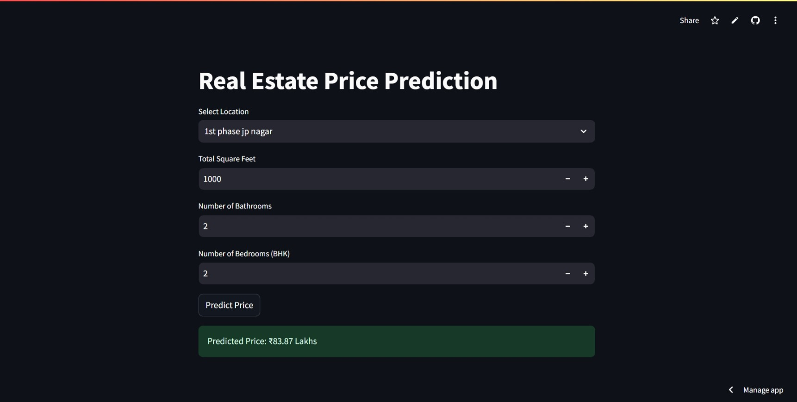

# Real Estate Price Prediction

## Project Overview

This project aims to predict the price of real estate properties in Bangalore based on key features such as location, total square footage, number of bathrooms, and number of bedrooms (BHK). The predictions help potential buyers or real estate developers estimate property prices in a given area.

The project explores various machine learning models to achieve the best accuracy, with a special focus on linear regression, Lasso regression, and decision tree regression.

## Table of Contents

- [Installation Guide](#installation-guide)
- [Usage](#usage)
- [Dataset](#dataset)
- [Model Information](#model-information)
- [Results](#results)
- [Streamlit App](#streamlit-app)

## Installation Guide

### 1. Clone the repository:
   ```bash
   git clone https://github.com/nipuran/real-estate-price-prediction.git
   ```

### 2. Navigate to the project directory:
   ```bash
   cd real-estate-price-prediction
   ```

### 3. Create a virtual environment:
   ```bash
   python -m virtualenv .venv
   ```

### 4. Activate the virtual environment:
   On **Windows**:
   ```bash
   .venv\Scripts\activate
   ```
   On **macOS/Linux**:
   ```bash
   source .venv/bin/activate
   ```

### 5. Install dependencies:
   ```bash
   pip install -r requirements.txt
   ```

   > **Note:** The `requirements.txt` file includes the following packages:
   > - [NumPy](https://pypi.org/project/numpy/) - For numerical computations.
   > - [Pandas](https://pypi.org/project/pandas/) - For data manipulation.
   > - [Matplotlib](https://pypi.org/project/matplotlib/) - For data visualization.
   > - [scikit-learn](https://pypi.org/project/scikit-learn/) - For building machine learning models.
   > - [Jupyter Notebook](https://pypi.org/project/notebook/) - For running notebooks interactively.
   > - [Streamlit](https://pypi.org/project/streamlit/) - For deploying the web app.

## Usage

1. Open the Jupyter Notebook to explore the dataset and model:
   ```bash
   jupyter notebook
   ```

2. Run the script to run the Streamlit app using the terminal:
   ```bash
   streamlit run app.py
   ```

## Dataset

[Bangalore House Price Dataset](https://www.kaggle.com/datasets/amitabhajoy/bengaluru-house-price-data) is used from Kaggle. The dataset contains various features such as area_type, availability, location, size, society, total_sqft, bath, balcony, and price.

## Model Information

The following models are experimented with to predict house prices:

- **Linear Regression**: A simple and interpretable model that assumes a linear relationship between the features and the target (price).
- **Lasso Regression**: A type of linear regression that adds L1 regularization, making it more robust by preventing overfitting.
- **Decision Tree Regression**: A non-linear model that splits the dataset into subsets to make more granular predictions, useful for capturing complex relationships between features.

## Techniques Used

### EDA (Exploratory Data Analysis):
- **Handling missing values**
- **Outlier detection**
- **Feature engineering**
- **One-Hot Encoding**

### Model Building:
- **Cross-validation**: Implemented using `ShuffleSplit` from `sklearn`.
- **Hyperparameter tuning**: Performed using `GridSearchCV` from `sklearn`.

The models have been fine-tuned using cross-validation, and the best model parameters are presented in the results section.

## Results

| Model              | Best Score | Best Parameters                                |
|--------------------|------------|-----------------------------------------------|
| Linear Regression   | 0.847951   | {'fit_intercept': False}                      |
| Lasso Regression    | 0.726739   | {'alpha': 2, 'selection': 'random'}           |
| Decision Tree       | 0.717428   | {'criterion': 'friedman_mse', 'splitter': 'best'} |


## Streamlit App

[Streamlit app](https://real-estate-price-prediction-nipuran.streamlit.app/) is deployed to showcase the model's predictions interactively.

### Preview


